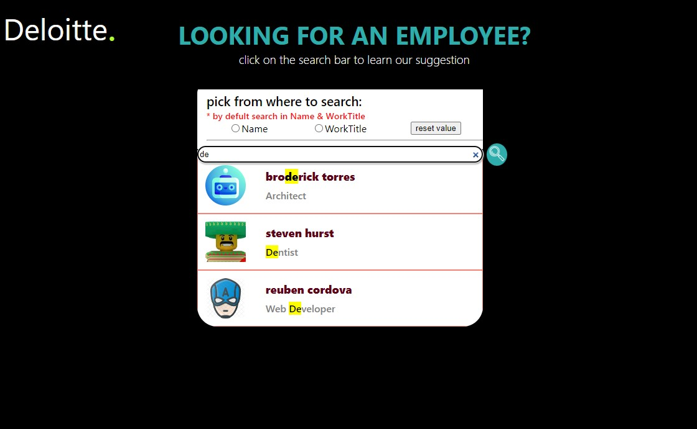

# search engine mini project-
## Deloitte home task -
### full stack project
- DataBase:ElasticSearch
- Backend: .Net core - C#
- FrontEnd: React - JaveScript

that is search engine that you can search the employees by there name/part of there name or by there job title/ part of it .

the gist of this project is to show usege of ElasticSearch Ngram feature, and to create api with .Net core framework  and basic usege of react . 

## some images of the project 

